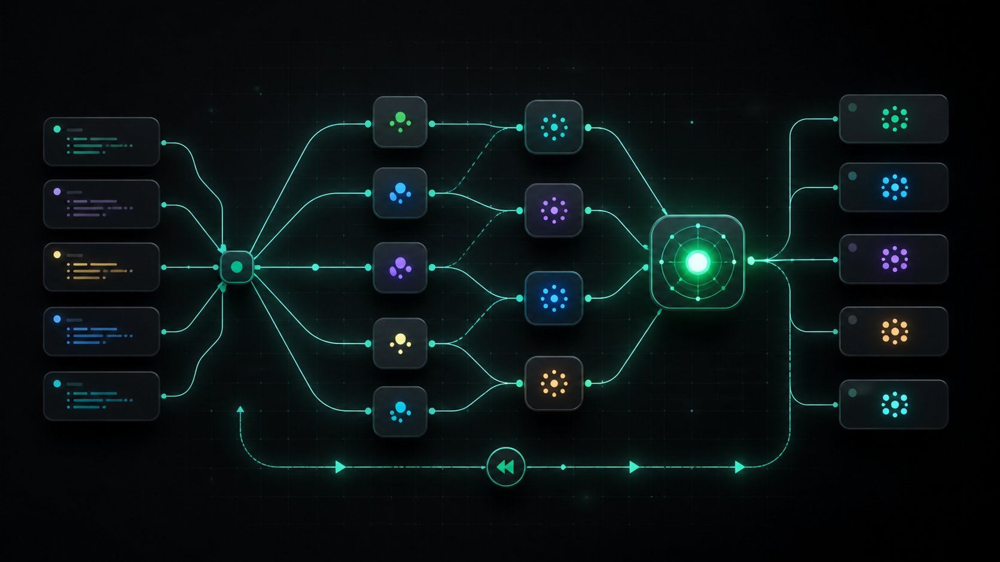

# gloop

`gloop` is a foreground-only Rust CLI for running configurable agent and command graphs. It combines a versioned DAG/loop IR, deterministic non-LLM scheduling, provider profiles, local artifacts, and journal replay without a daemon or cross-project queue.



Compose provider-backed agents and commands into a graph, fan out work in parallel, merge results, and replay the run locally.

## Install

Install the latest version directly from the public GitHub repository (works from any directory):

```bash
cargo install --git https://github.com/moto-taka/gloop --locked gloop-cli
```

On macOS or Linux with [Homebrew](https://brew.sh/):

```bash
brew install moto-taka/tap/gloop
```

### Automated publishing

Pushes to `main` run [`.github/workflows/release.yml`](.github/workflows/release.yml).
After `cargo test --workspace` succeeds, it creates a `vX.Y.Z` tag and GitHub Release
when that workspace version has not been released yet, then updates
`moto-taka/homebrew-tap/Formula/gloop.rb` automatically.

To enable the cross-repository update, add a fine-grained GitHub token as the
`HOMEBREW_TAP_TOKEN` Actions secret on this repository. The token only needs
`Contents: Read and write` access to `moto-taka/homebrew-tap`. Update the workspace
version and the internal path-dependency versions together before merging to `main`.

The binary is named `gloop`. To install from a local checkout instead, run the command from the repository root:

```bash
cargo install --path crates/gloop-cli --locked
```

## Quickstart

Create a graph from a template, validate it, and inspect its shape:

```bash
gloop graph new workflow.yaml \
  --name direct \
  --goal "Summarize the latest changes" \
  --template direct \
  --request "Summarize the latest changes"

gloop graph validate workflow.yaml
gloop graph explain workflow.yaml
gloop graph render workflow.yaml --format mermaid
```

Try a blind parallel review example:

```bash
gloop graph validate examples/multi-provider-review.yaml
gloop run --graph examples/multi-provider-review.yaml --repo .
```

See [examples/multi-provider-review.yaml](examples/multi-provider-review.yaml), with context in
[examples/review-input.md](examples/review-input.md). The review graph uses built-in profiles (`claude`, `opencode`, and `qwen`) and requires whichever provider CLIs/auth are installed for your setup.

Run a two-designer wall-bounce: `claude` (model `fable`) and `codex` (model
`gpt-5.6-sol`) produce blind independent designs, critique each other's
proposal, revise in light of the critique, and a final node integrates both.

```bash
gloop graph new design.yaml --template design-wall-bounce --request "Design the sync engine"
gloop run --graph design.yaml --repo .
```

### Orchestration patterns

Three templates cover the common multi-agent shapes (see `examples/`):

```bash
# Council: two blind designs -> one integrated design -> implementation ->
# three reviewer panel -> reconciled verdict (like a /council flow).
gloop graph new council.yaml --template council --request "Design the rate limiter"

# Decompose: one model splits the task into up to 4 packages, lightweight
# worker lanes execute them in parallel, an integrator assembles the result.
gloop graph new decompose.yaml --template decompose-fanout-reduce --request "Refactor the module"

# Implement-test-loop: implement, then a bounded loop runs your test command;
# on failure a fixer consumes the failure details and the loop retries until
# the command passes (edit the placeholder test command first).
gloop graph new work.yaml --template implement-test-loop --loop-cap 3 \
  --request "Implement the feature and keep the test suite green"
```

The test-fix loop is a `Loop` node: each iteration runs `test`; a failure
edge routes the failure details to `fix`, and the loop repeats until `test`
succeeds, hits `--loop-cap`, or stagnates. This is how gloop combines graphs
and loops to push toward the goal.

The template is also selectable in the TUI (`t` opens a template picker with
previews) and in
`gloop graph new --interactive`.

Create a graph interactively, in the style of TAKT's authoring flow:

```bash
gloop graph new workflow.yaml --interactive
```

Start the resident Graph Agent TUI when you want to choose the graph, harness,
profile, model, and task from one keyboard-first workspace:

```bash
gloop graph
# explicit alias, with an explicit language:
gloop graph tui --lang ja
```

The TUI keeps the existing Graph IR and foreground runtime. Use `1/2/3` for
Overview / Graph Builder / Run Monitor, `i` for the natural-language task
(multi-line: `Enter` saves, `Alt+Enter` (or `Shift+Enter` where the terminal
reports it) inserts a newline, `Esc` cancels),
`t/p/m` to pick template/profile/model from preview pickers, `v` to validate
(the issue list opens automatically), `s` to save, and `r` to run (auto-saves
first). During a run, `o` opens the selected node's output, and `?` opens
help. `Ctrl-C` cancels an active run; `q` exits when idle.

The interface language follows your system locale (`GLOOP_LANG`, `LC_ALL`,
`LC_MESSAGES`, or `LANG`; Japanese and English are supported) and can be
switched live with `l` or forced with `--lang`.
See [docs/TUI_DESIGN.md](docs/TUI_DESIGN.md) for the screen model.

### Watching runs from scripts and agents

`gloop status` reads one run's journal live, so humans and AI agents can poll
progress and intermediate outputs while the run is still in flight:

```bash
# start a run in the background with a stable id
gloop run --graph workflow.yaml --repo . --run-id my-task &

# poll it from another terminal, script, or supervisor agent
gloop status my-task --json
gloop status --json            # newest run
gloop status my-task --wait    # block until finished, exit with the run's code
```

The JSON payload reports `phase` (`initializing` / `running` / `finished`),
per-node status, attempts, intermediate outputs, the recent event tail, and
the merged final `summary` once the run completes. `--json` always exits 0
when the query succeeds; `--wait` exits with the run's own status code
(`0` success, `2` blocked/human gate, `3` verification/execution failure,
`5` budget exhausted, `130` cancelled).

Save a reusable project template interactively (the wizard builds graphs node-by-node and selects providers from your configured profiles) or non-interactively from a built-in base:

```bash
gloop graph init
gloop graph init --name my-review-flow --from review-fix-loop \
  --description "Bounded review and fix loop" \
  --request "Review the latest diff"

gloop graph init --list
gloop graph new workflow.yaml --template my-review-flow
```

See everything available in the current project:

~~~text
gloop graph list
gloop graph list --lang ja
~~~

'graph init --list' is only the short template list. 'graph list' also shows
saved project templates and graph YAML files, including node/edge counts and
validation status. Start editing by copying a name from the list:

~~~text
gloop graph edit plan-implement-verify --gui
~~~

Built-in templates are read-only until you save them. The first save creates
'.gloop/graphs/plan-implement-verify.yaml'; later edits open that saved graph.
For a named reusable project template, use:

~~~text
gloop graph init --name my-flow --from plan-implement-verify --gui --lang ja
gloop graph update my-flow --gui
~~~

Open the graph in a local browser with an n8n-style visual editor. The screen
has three areas: choose a processing type on the left, see the whole workflow
in the middle, and configure the selected step on the right. Available types
are AI processing, local command execution, result verification, and a human
approval checkpoint. Each new step starts with a descriptive name, empty saved
input, and a realistic placeholder example instead of a hidden no-op value.
Technical fields stay behind "Technical settings". The editor only binds to loopback, shows enabled
execution tools with per-tool model choices (discovered at launch from each CLI's supported list
command when available), and writes through gloop's normal
validation and atomic-save path:

```bash
gloop graph init --gui --lang en
gloop graph edit workflow.yaml --gui --lang ja
gloop graph update my-review-flow --repo /path/to/project --gui
```

Without `--gui`, `graph edit` and `graph update` use the existing interactive
TUI for selective node and edge edits. `update` addresses a saved project
template by name; `edit` accepts a graph YAML path or any name shown by
`gloop graph list`.

If you do not know what to type, use this order:

1. gloop graph list
2. Pick one name or file from the output.
3. For a visual editor, run: gloop graph edit NAME --gui
4. Click a step, choose what it should do, leave the AI/app and model at their
   defaults if unsure, and press Save.
5. Run gloop graph validate PATH and then gloop run --graph PATH --repo .

The bundled skill at skills/gloop-graph-authoring/SKILL.md contains the same
flow in short, copyable instructions for an agent or assistant that does not
know gloop yet.

Run a saved graph in the foreground:

```bash
gloop run --graph workflow.yaml --repo /path/to/project
```

For a small task, create and run a one-node graph directly. `--profile` selects the harness/provider and `--model` remains an arbitrary model id or alias:

```bash
gloop run "Fix the failing authentication test" \
  --profile codex \
  --model gpt-5.3-codex-spark \
  --non-interactive \
  --repo /path/to/project
```

Use `--dry-run` to validate and print the generated graph without invoking a provider. With `--json`, stdout contains exactly one final JSON value; progress is written to stderr only in human-readable mode.

Run artifacts are stored under `<repo>/.gloop/runs/<run-id>`. They can be inspected without rerunning any model:

```bash
gloop inspect .gloop/runs/<run-id> --json
gloop logs .gloop/runs/<run-id> --json
gloop replay .gloop/runs/<run-id> --json
```

## Prompt, context, harness, graph, and loop engineering

These are first-class parts of gloop's graph IR rather than hidden conventions:

- **Prompt engineering** — provider nodes accept inline prompts or external prompt packages with optional version metadata. Packages support bounded variable substitution (`{{name}}`), node identity (`{{node_id}}`), explicit dependency insertion (`{{dependencies}}`), and dedicated `reduce`/`synthesize` stages for turning many outputs into a deliberate next prompt. Output contracts can require text or JSON validated against a schema.
- **Context engineering** — every node declares its context budget and can select workspace files plus predecessor outputs. Context is rendered deterministically, kept inside the selected workspace, and rejected when it exceeds the byte limit; this makes the prompt/context boundary inspectable in run artifacts. gloop provides explicit context composition, not an implicit vector database or automatic retrieval layer.
- **Harness engineering** — provider profiles isolate the execution harness from graph logic. The same node can target built-in CLIs (Codex, Claude, Qwen, Cursor, Pi, OpenCode), any generic command, OpenAI-compatible HTTP (including OpenRouter), or Anthropic-compatible HTTP. Capability routing, credential references, output normalization, process-group cancellation, workspaces, retries, artifacts, and journal replay are handled by the runtime around each invocation.
- **Graph and loop engineering** — outer graphs are validated DAGs with fan-out/fan-in, conditional and failure edges, resource serialization, and nested subgraphs. Repetition is explicit and bounded through `loop` nodes with success/output/JSON conditions, stagnation guards, and a hard iteration cap. Use `gloop graph new --interactive` to author these flows from the CLI.

The boundary is intentional: gloop supplies the controllable building blocks for these practices; it does not silently rewrite prompts, invent context, or run an unbounded autonomous loop.

## Execution model

The runtime implements:

- deterministic DAG compilation and foreground scheduling;
- fan-out/fan-in, conditional failure edges, subgraphs, and bounded nested loops;
- maximum parallelism (256), graph nesting (32), nested node count (10,000), model-call and wall-time budgets;
- bounded retry (at most 16 attempts) with ordered profile rebinding, loops capped at 1,024 iterations;
- fail-closed provider retry safety: HTTP 429 rejections may retry, and profile rebinding may recover failures detected before invocation; timeout, transport, 408/409/425/5xx, process, oversized-output, and invalid-output failures are never replayed because the original request may already have been accepted;
- failed `subgraph`/`loop` attempts are never replayed as a whole because earlier children or iterations may already have succeeded; put retry policies on the individual inner provider nodes instead;
- serialization of nodes that claim the same resource;
- command and verification nodes with capped output;
- run-wide retained-output accounting for stdout/stderr/raw output (64 MiB total);
- `max_parallel` is a scheduler-wide cap; nested graphs inherit and can lower it (effective cap is the tighter bound in scope);
- typed provider failures and status-specific CLI exit codes;
- per-attempt stdout, stderr, normalized output, summary snapshots, and a hash-chained JSONL journal;
- scheduler replay and completed-run inspection.

Roles are prompt data, not hardcoded runtime concepts. Graph structure, profile, model, prompt, output schema, and retry policy remain configurable per node.

## Provider profiles

Profiles are layered in this order:

1. built-ins;
2. the OS-specific user config directory (`gloop/profiles.toml`);
3. `<project>/.gloop/profiles.toml` (opt-in only via `--trust-project-profiles`).

The built-in command profiles are `codex`, `claude`, `qwen`, `cursor-agent`, `pi`, and `opencode`.

Profile kinds:

- `command` for local executables.
- `openai` for OpenAI-compatible HTTP providers.
- `anthropic` for Anthropic-compatible HTTP providers.

Provider execution uses environment-sourced credentials (`*_env`/`headers_from`) and local command profiles run with a constrained environment:

- the command process clears inherited environment and only reintroduces required allowlist entries and mapped `env_from` values,
- sensitive provider keys are redacted from logs and event output.
- command version probes check required credential presence but do not inject mapped `env_from` secret values into the probe process.

`HOME` is intentionally retained for command profiles so authenticated harnesses such as
Codex CLI, Claude Code, Qwen, Pi, and OpenCode can reuse their normal user login. Treat every
configured command harness as trusted local code: it can read files that its operating-system
user can read, including harness-owned authentication state. Project profiles remain disabled
unless `--trust-project-profiles` is supplied. Gloop does not add a general filesystem sandbox;
among the built-ins, `native_sandbox` is currently declared only by the Codex profile.

Example generic command profile:

```toml
[profiles.my-agent]
kind = "command"
argv = ["my-agent", "run"]
prompt_mode = "argument"
prompt_args = ["--prompt", "{prompt}"]
model_args = ["--model", "{model}"]
version_args = ["--version"]
output = "jsonl"
output_pointer = "/result"
timeout_seconds = 900
```

Example OpenAI-compatible profile:

```toml
[profiles.local-openai]
kind = "openai"
base_url = "http://127.0.0.1:8000/v1"
model = "local-model"
# Optional for endpoints that do not require authentication:
# api_key_env = "LOCAL_OPENAI_API_KEY"
```

OpenRouter uses the same adapter. Keep the key in the environment and choose any
OpenRouter model id in the profile:

```toml
[profiles.openrouter]
kind = "openai"
base_url = "https://openrouter.ai/api/v1/"
model = "openai/gpt-oss-20b:free"
api_key_env = "OPENROUTER_API_KEY"
timeout_seconds = 90
parameters = { max_tokens = 256 }
```

Copy [examples/openrouter-profiles.toml](examples/openrouter-profiles.toml) to
`.gloop/profiles.toml`, then run with `--trust-project-profiles`. The example
also includes `openrouter-deepseek-v4-flash` and `openrouter-luna`; provider
model catalogs can change, so confirm their current model ids before a run.

[examples/openrouter-json.yaml](examples/openrouter-json.yaml) is an OpenRouter
JSON-schema example. Reasoning models can consume output budget before emitting
assistant text, so use practical `max_tokens` values.

Example Anthropic-compatible profile:

```toml
[profiles.anthropic-api]
kind = "anthropic"
model = "claude-sonnet-4-5"
api_key_env = "ANTHROPIC_API_KEY"
max_tokens = 8192
```

Secrets are referenced by environment-variable name and are not written into the profile. Useful commands:

```bash
gloop provider list --json
gloop provider probe codex --json
gloop provider doctor --json
gloop provider add my-agent 'kind = "command" argv = ["my-agent"]'
```

## Graph IR

The schema version is `gloop.dev/v1alpha1`. Supported node kinds are `agent`, `command`, `reduce`, `synthesize`, `verify`, `gate`, `loop`, and `subgraph`. Supported edge kinds are `data`, `control`, `resource`, `conditional`, and `failure`.

Unknown fields are rejected. Outer graphs must be acyclic; repetition is represented by a bounded `loop` node. Agent-like nodes accept optional `profile` and `model` bindings, while output contracts can require text or JSON and an inline or file-based JSON Schema.

Generate the complete machine-readable schema with:

```bash
gloop graph schema --json
```

See [docs/SCHEMA.md](docs/SCHEMA.md) and the graphs in [examples](examples).

## Exit codes

| Code | Meaning |
|---:|---|
| 0 | ready for human / command succeeded |
| 2 | blocked or gate rejected |
| 3 | node or verification failure |
| 4 | provider/adapter unavailable |
| 5 | budget exhausted |
| 6 | invalid graph or arguments |
| 7 | unresolved provider profile/capability |
| 130 | cancelled |

## Known limitations

- Execution is foreground-only. There is no daemon, account lease, or cross-project queue.
- `readonly` is intentionally unsupported without a filesystem sandbox; the run fails explicitly when requested.
- `worktree` workspace mode uses a dedicated runtime manager for isolated sibling worktrees. It:
  - runs a Git preflight with `.gloop` excluded from cleanliness checks,
  - captures the base commit from `HEAD` (or uses a caller-provided explicit base),
  - generates unique retained worktree branches and paths per run/node,
  - reuses the same node worktree across retries,
  - preserves dirty worktrees on failed/cancelled attempts,
  - does not push, merge, or auto-delete retained worktrees.
- Worktree mode disables hooks, external filesystem monitors, and external diff/textconv helpers. It re-checks and rejects repository-local `filter.*.clean`, `filter.*.smudge`, `filter.*.process`, `diff.*.command`, and `diff.*.textconv` configuration before Git operations because those programs could otherwise execute during checkout/staging/inspection; use `current`/`inherit` or remove the local driver configuration.
- Final successful worktree nodes can auto-commit into their dedicated branch when `auto_commit` is enabled, and `inherit` reuses the true source workspace by identity.
- Cancellation is process-group based on Unix builds (`ProcessGroup`) and direct-child on non-Unix platforms.
- Profiles accept arbitrary model ids and aliases. Command profiles expose their
  model list in the GUI and TUI selectors, discovered at launch from each CLI's
  own listing command: `cursor-agent`/`pi` use `--list-models`, `opencode` uses
  `models`, `aider` uses `--list-models ""` (bundled offline catalog), `codex`
  uses `codex debug models` (only `visibility: "list"` entries), and
  `claude`/`qwen` answer a client-side `/model` probe (`claude --bare -p
  /model`, `qwen --safe-mode -p /model`) without a model call; `qwen` currently
  reports its active model only. Remote provider catalogs are still not
  enumerated, and each node invocation is fresh.
- Empty model/provider outputs are rejected when they do not satisfy node output contracts (including text/JSON output mode checks).
- Serialized HTTP provider request bodies are capped at 1 MiB; profile `parameters` maps are capped at 256 entries and 256 KiB serialized.
- Replay validates hash-chain integrity, run-id/sequence order, and schema compatibility before accepting a rerun; replay rehydrates scheduler state from events and summary checks. These unkeyed hashes detect partial/corrupt edits, not a same-user attacker who can consistently rewrite the whole run directory.
- Replay does not promise byte-identical re-execution of an LLM.
- External provider CLI/API credentials and billing remain provider-owned. Gloop surfaces provider-level auth/usage failures; it does not charge on behalf of providers.

## Attribution

The clean-room design draws on TAKT's workflow authoring ideas and Bernstein's deterministic runtime ideas, with provider/evolution research informed by the other pinned projects in [THIRD_PARTY_NOTICES.md](THIRD_PARTY_NOTICES.md). No daemon or queue layer is included in this scope.
