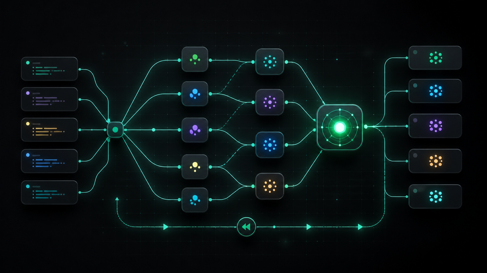
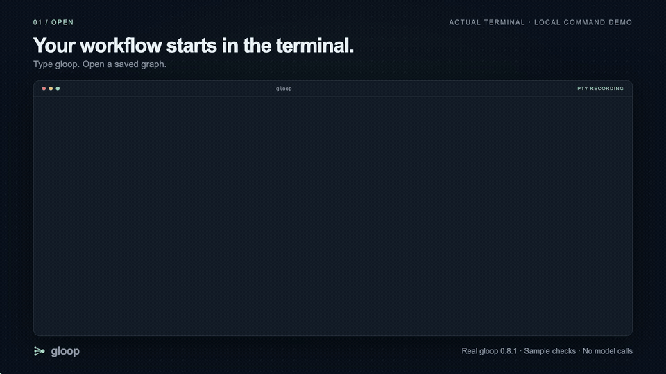
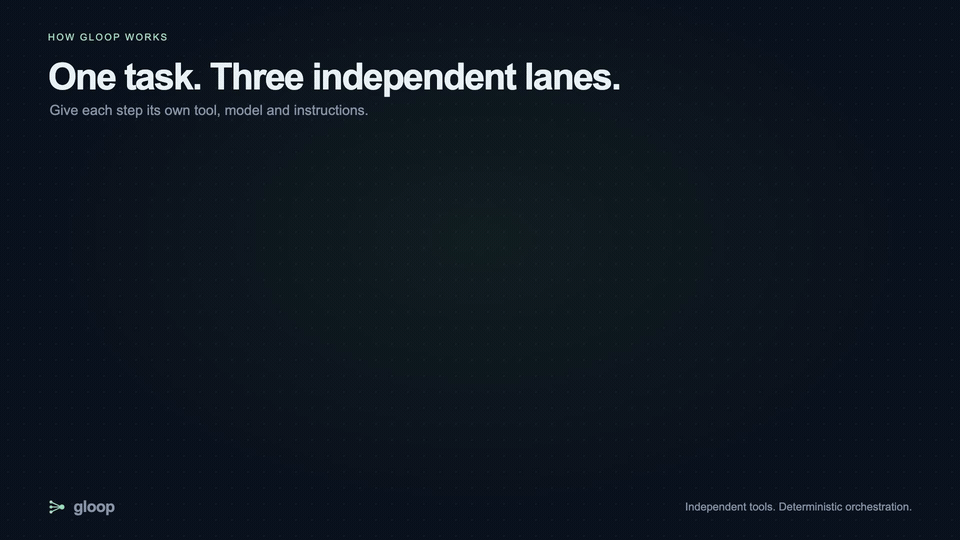

# gloop

`gloop` is a local workspace for giving independent AI tools a task, watching their progress, and passing results to another model. Open the terminal workspace with `gloop`, use the CLI from any coding agent, or open the optional GUI with `gloop ui`. An AI can propose the steps; scheduling and result handoff use no LLM. Selected providers consume their own usage.

Underneath, gloop runs configurable agent and command graphs with deterministic scheduling, provider profiles, local artifacts, and journal replay. Independent tasks need no resident daemon; the existing `gloop run` command remains available for foreground execution.



Compose provider-backed agents and commands into a graph, fan out work in parallel, merge results, and replay the run locally.

## See it in motion

**The real terminal — launch, run three checks, combine their results.**

[](https://github.com/moto-taka/gloop/releases/download/v0.8.1/gloop-terminal.mp4)

[Watch the 31-second video](https://github.com/moto-taka/gloop/releases/download/v0.8.1/gloop-terminal.mp4).
Recorded from an actual gloop 0.8.1 terminal session with local sample commands and no model calls.

**The idea — three independent lanes, one combined result.**

[](https://github.com/moto-taka/gloop/releases/download/v0.8.1/gloop-parallel.mp4)

[Watch the 21-second animation](https://github.com/moto-taka/gloop/releases/download/v0.8.1/gloop-parallel.mp4).
Both videos are silent. [Remotion source and recording details](media/README.md).

## Install

Install the latest version directly from the public GitHub repository (works from any directory):

```bash
cargo install --git https://github.com/moto-taka/gloop --locked gloop-cli
```

On macOS or Linux with [Homebrew](https://brew.sh/):

```bash
brew install moto-taka/tap/gloop
```

The binary is named `gloop`. To install from a local checkout instead, run the command from the repository root:

```bash
cargo install --path crates/gloop-cli --locked
```

## Quickstart

Open gloop in your project:

```bash
cd /path/to/project
gloop
```

Use `gloop --lang ja` for Japanese. Saved graphs appear first: **Enter** opens
one, and **r** runs it.

To build a new workflow, choose **+ Graph · Manual**:

1. **a** → type an instruction → **Enter**. Repeat to add the next AI step.
2. **p** changes its AI tool; **m** changes its model. **A** adds a branch;
   **c** connects existing steps.
3. **r** runs the graph with live status; **s** saves it.

**Enter** edits a step, **O** opens a file, and **Tab** holds detailed settings.
**q** stops an active Manual run and closes an idle view. Editing makes no AI calls.

Choose **Auto** to have an AI propose a workflow, then review it before running.
Choose **1 AI** for a single request. These tasks continue after closing the TUI;
reopen `gloop` to see their results. Saved workflows can also run independently
through **Background run**. Use Manual for interactive approval steps.

For all keyboard controls and execution limits, see [the workspace guide](docs/TASKS.md).

## Commands

| Command | Purpose |
| --- | --- |
| `gloop` | Open the terminal workspace. |
| `gloop run --graph FILE` | Run a saved workflow in this terminal. |
| `gloop start "TASK" --profile TOOL` | Start a task in the background. |
| `gloop tasks [ID]` | List background tasks or read a result. |
| `gloop stop ID` | Stop a background task. |
| `gloop graph --help` | Create, edit, and validate graph files. |
| `gloop provider --help` | Configure AI tools and check availability. |
| `gloop ui` | Open the browser workspace. |
| `gloop debug --help` | Inspect run status and execution records. |

Add `--repo PATH` to work on another project. For scripts, use `--json` on
commands that return results. See [the command reference](docs/CLI.md) for
workflow templates, advanced editing, diagnostics, and older command spellings.
See [independent tasks](docs/TASKS.md) for task lifecycle and execution limits.

## Prompt, context, harness, graph, and loop engineering

These are first-class parts of gloop's graph IR rather than hidden conventions:

- **Prompt engineering** — provider nodes accept inline prompts or external prompt packages with optional version metadata. Packages support bounded variable substitution (`{{name}}`), node identity (`{{node_id}}`), explicit dependency insertion (`{{dependencies}}`), and dedicated `reduce`/`synthesize` stages for turning many outputs into a deliberate next prompt. Output contracts can require text or JSON validated against a schema.
- **Context engineering** — every node declares its context budget and can select workspace files plus predecessor outputs. Context is rendered deterministically, kept inside the selected workspace, and rejected when it exceeds the byte limit; this makes the prompt/context boundary inspectable in run artifacts. gloop provides explicit context composition, not an implicit vector database or automatic retrieval layer.
- **Harness engineering** — provider profiles isolate the execution harness from graph logic. The same node can target built-in CLIs (Codex, Claude, Qwen, Cursor, Pi, OpenCode), any generic command, OpenAI-compatible HTTP (including OpenRouter), or Anthropic-compatible HTTP. Capability routing, credential references, output normalization, process-group cancellation, workspaces, retries, artifacts, and journal replay are handled by the runtime around each invocation.
- **Graph and loop engineering** — outer graphs are validated DAGs with fan-out/fan-in, conditional and failure edges, resource serialization, and nested subgraphs. Repetition is explicit and bounded through `loop` nodes with success/output/JSON conditions, stagnation guards, and a hard iteration cap. Use `gloop graph new --interactive` to author these flows from the CLI.

The boundary is intentional: gloop supplies the controllable building blocks for these practices; it does not silently rewrite prompts, invent context, or run an unbounded autonomous loop.

## Execution model

The runtime implements:

- deterministic DAG compilation and foreground scheduling;
- fan-out/fan-in, conditional failure edges, subgraphs, and bounded nested loops;
- maximum parallelism (256), graph nesting (32), nested node count (10,000), model-call and wall-time budgets;
- bounded retry (at most 16 attempts) with ordered profile rebinding, loops capped at 1,024 iterations;
- fail-closed provider retry safety: HTTP 429 rejections may retry, and profile rebinding may recover failures detected before invocation; timeout, transport, 408/409/425/5xx, process, oversized-output, and invalid-output failures are never replayed because the original request may already have been accepted;
- failed `subgraph`/`loop` attempts are never replayed as a whole because earlier children or iterations may already have succeeded; put retry policies on the individual inner provider nodes instead;
- serialization of nodes that claim the same resource;
- command and verification nodes with capped output;
- run-wide retained-output accounting for stdout/stderr/raw output (64 MiB total);
- `max_parallel` is a scheduler-wide cap; nested graphs inherit and can lower it (effective cap is the tighter bound in scope);
- typed provider failures and status-specific CLI exit codes;
- per-attempt stdout, stderr, normalized output, summary snapshots, and a hash-chained JSONL journal;
- scheduler replay and completed-run inspection.

Roles are prompt data, not hardcoded runtime concepts. Graph structure, profile, model, prompt, output schema, and retry policy remain configurable per node.

## Provider profiles

Profiles are layered in this order:

1. built-ins;
2. the OS-specific user config directory (`gloop/profiles.toml`);
3. `<project>/.gloop/profiles.toml` (opt-in only via `--trust-project-profiles`).

The built-in command profiles are `codex`, `claude`, `qwen`, `cursor-agent`, `pi`, and `opencode`.

Profile kinds:

- `command` for local executables.
- `openai` for OpenAI-compatible HTTP providers.
- `anthropic` for Anthropic-compatible HTTP providers.

Provider execution uses environment-sourced credentials (`*_env`/`headers_from`) and local command profiles run with a constrained environment:

- the command process clears inherited environment and only reintroduces required allowlist entries and mapped `env_from` values,
- sensitive provider keys are redacted from logs and event output.
- command version probes check required credential presence but do not inject mapped `env_from` secret values into the probe process.

`HOME` is intentionally retained for command profiles so authenticated harnesses such as
Codex CLI, Claude Code, Qwen, Pi, and OpenCode can reuse their normal user login. Treat every
configured command harness as trusted local code: it can read files that its operating-system
user can read, including harness-owned authentication state. Project profiles remain disabled
unless `--trust-project-profiles` is supplied. Gloop does not add a general filesystem sandbox;
among the built-ins, `native_sandbox` is currently declared only by the Codex profile.

Example generic command profile:

```toml
[profiles.my-agent]
kind = "command"
argv = ["my-agent", "run"]
prompt_mode = "argument"
prompt_args = ["--prompt", "{prompt}"]
model_args = ["--model", "{model}"]
version_args = ["--version"]
output = "jsonl"
output_pointer = "/result"
timeout_seconds = 900
```

Example OpenAI-compatible profile:

```toml
[profiles.local-openai]
kind = "openai"
base_url = "http://127.0.0.1:8000/v1"
model = "local-model"
# Optional for endpoints that do not require authentication:
# api_key_env = "LOCAL_OPENAI_API_KEY"
```

OpenRouter uses the same adapter. Keep the key in the environment and choose any
OpenRouter model id in the profile:

```toml
[profiles.openrouter]
kind = "openai"
base_url = "https://openrouter.ai/api/v1/"
model = "openai/gpt-oss-20b:free"
api_key_env = "OPENROUTER_API_KEY"
timeout_seconds = 90
parameters = { max_tokens = 256 }
```

Copy [examples/openrouter-profiles.toml](examples/openrouter-profiles.toml) to
`.gloop/profiles.toml`, then run with `--trust-project-profiles`. The example
also includes `openrouter-deepseek-v4-flash` and `openrouter-luna`; provider
model catalogs can change, so confirm their current model ids before a run.

[examples/openrouter-json.yaml](examples/openrouter-json.yaml) is an OpenRouter
JSON-schema example. Reasoning models can consume output budget before emitting
assistant text, so use practical `max_tokens` values.

Example Anthropic-compatible profile:

```toml
[profiles.anthropic-api]
kind = "anthropic"
model = "claude-sonnet-4-5"
api_key_env = "ANTHROPIC_API_KEY"
max_tokens = 8192
```

Secrets are referenced by environment-variable name and are not written into the profile. Useful commands:

```bash
gloop provider list --json
gloop provider probe codex --json
gloop provider doctor --json
gloop provider add my-agent 'kind = "command" argv = ["my-agent"]'
```

## Graph IR

The schema version is `gloop.dev/v1alpha1`. Supported node kinds are `agent`, `command`, `reduce`, `synthesize`, `verify`, `gate`, `loop`, and `subgraph`. Supported edge kinds are `data`, `control`, `resource`, `conditional`, and `failure`.

Unknown fields are rejected. Outer graphs must be acyclic; repetition is represented by a bounded `loop` node. Agent-like nodes accept optional `profile` and `model` bindings, while output contracts can require text or JSON and an inline or file-based JSON Schema.

Generate the complete machine-readable schema with:

```bash
gloop graph schema --json
```

See [docs/SCHEMA.md](docs/SCHEMA.md) and the graphs in [examples](examples).

## Exit codes

| Code | Meaning |
|---:|---|
| 0 | ready for human / command succeeded |
| 2 | blocked or gate rejected |
| 3 | node or verification failure |
| 4 | provider/adapter unavailable |
| 5 | budget exhausted |
| 6 | invalid graph or arguments |
| 7 | unresolved provider profile/capability |
| 130 | cancelled |

## Known limitations

- Manual and `gloop run` execute in the foreground; `gloop start` and Auto/direct tasks use independent background workers. There is no cross-project queue or account lease.
- `readonly` is intentionally unsupported without a filesystem sandbox; the run fails explicitly when requested.
- `worktree` workspace mode uses a dedicated runtime manager for isolated sibling worktrees. It:
  - runs a Git preflight with `.gloop` excluded from cleanliness checks,
  - captures the base commit from `HEAD` (or uses a caller-provided explicit base),
  - generates unique retained worktree branches and paths per run/node,
  - reuses the same node worktree across retries,
  - preserves dirty worktrees on failed/cancelled attempts,
  - does not push, merge, or auto-delete retained worktrees.
- Worktree mode disables hooks, external filesystem monitors, and external diff/textconv helpers. It re-checks and rejects repository-local `filter.*.clean`, `filter.*.smudge`, `filter.*.process`, `diff.*.command`, and `diff.*.textconv` configuration before Git operations because those programs could otherwise execute during checkout/staging/inspection; use `current`/`inherit` or remove the local driver configuration.
- Final successful worktree nodes can auto-commit into their dedicated branch when `auto_commit` is enabled, and `inherit` reuses the true source workspace by identity.
- Cancellation is process-group based on Unix builds (`ProcessGroup`) and direct-child on non-Unix platforms.
- Profiles accept arbitrary model ids and aliases. Command profiles expose their
  model list in the GUI and TUI selectors, discovered at launch from each CLI's
  own listing command: `cursor-agent`/`pi` use `--list-models`, `opencode` uses
  `models`, `aider` uses `--list-models ""` (bundled offline catalog), `codex`
  uses `codex debug models` (only `visibility: "list"` entries), and
  `claude`/`qwen` answer a client-side `/model` probe (`claude --bare -p
  /model`, `qwen --safe-mode -p /model`) without a model call; `qwen` currently
  reports its active model only. Remote provider catalogs are still not
  enumerated, and each node invocation is fresh.
- Empty model/provider outputs are rejected when they do not satisfy node output contracts (including text/JSON output mode checks).
- Serialized HTTP provider request bodies are capped at 1 MiB; profile `parameters` maps are capped at 256 entries and 256 KiB serialized.
- Replay validates hash-chain integrity, run-id/sequence order, and schema compatibility before accepting a rerun; replay rehydrates scheduler state from events and summary checks. These unkeyed hashes detect partial/corrupt edits, not a same-user attacker who can consistently rewrite the whole run directory.
- Replay does not promise byte-identical re-execution of an LLM.
- External provider CLI/API credentials and billing remain provider-owned. Gloop surfaces provider-level auth/usage failures; it does not charge on behalf of providers.

## Automated publishing

Pushes to `main` run [`.github/workflows/release.yml`](.github/workflows/release.yml).
After `cargo test --workspace` succeeds, it creates a `vX.Y.Z` tag and GitHub Release
when that workspace version has not been released yet, then updates
`moto-taka/homebrew-tap/Formula/gloop.rb` automatically.

To enable the cross-repository update, add a fine-grained GitHub token as the
`HOMEBREW_TAP_TOKEN` Actions secret on this repository. The token only needs
`Contents: Read and write` access to `moto-taka/homebrew-tap`. Update the workspace
version and the internal path-dependency versions together before merging to `main`.

## Attribution

The clean-room design draws on TAKT's workflow authoring ideas and Bernstein's deterministic runtime ideas, with provider/evolution research informed by the other pinned projects in [THIRD_PARTY_NOTICES.md](THIRD_PARTY_NOTICES.md). No daemon or queue layer is included in this scope.
